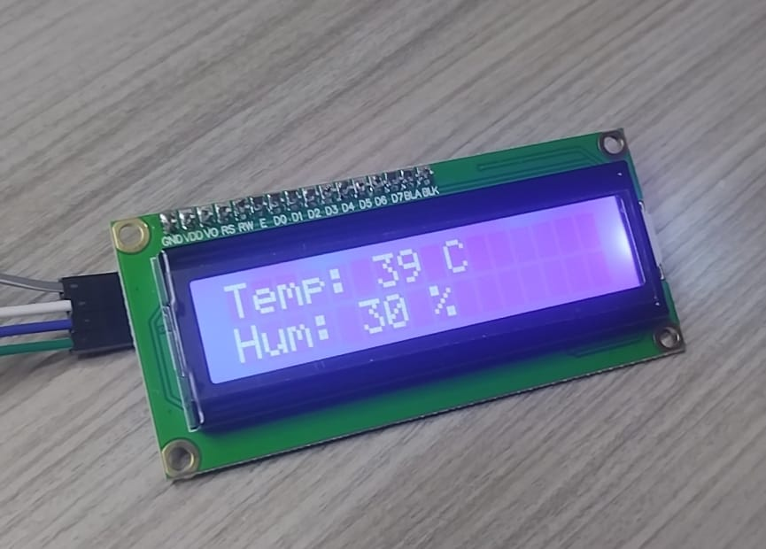

# PROYECTO PORCIS  

El proyecto Porcis nace como una forma de solución a una problemática vista en el día a día de algunos familiares, pues la muerte de un cerdo suele ser una perdida bastante grande.  

## COMIENZO DE PORCIS

Se empezó por entender el problema, el cuál consiste principalmente en el control de las variables ambientales, pues son el principal problema de la muerte de los cerdos.  

Con esto en mente ya se sabía que el primer paso era medir estas variables, que para este proyecto inicial se decidió que fueran la temperatura y la humedad.
Para lograr esto, se usó el sensor AHT20 + BMP280, pero solo se usó la parte correspondiente al AHT20 que corresponde a temperatura y humedad.
Este sensor usa I2C como protocolo de comunicación, que se puede considerar una ventaja en algunos casos, pero definitivamente no en este.

### PROBLEMA PRINCIPAL PARA EL PROYECTO
Debido a las limitaciones de este proyecto, en especial, el no uso de microcontroladores, la dificultad aumenta de forma exponencial. Debido a que la mayoría de tutoriales, repositorios, foros e información en general, se encuentra para microcontroladores,
pero la información para la FPGA es muy limitada.  

### I2C Y SENSOR AHT20  
Empezando desde el desconocimiento total, se decidió crear un módulo i2c_master desde 0, el cuál fue buena práctica para entender el funcionamiento del protocolo, pero desde luego una mala idea para el proyecto en general, pues se requiere de un módulo i2c_master
más avanzado al que se puede crear con los conocimientos y herramientas con las que contamos en este momento.  
Después de ver que crear un i2c_master era una mala idea, se buscó más información, llegando a la librería de Alex Forencich, la cuál es la que ha permitido el buen desarrollo del proyecto.  
Con la librería de Alex hubo un cambio de enfoque, ahora se buscaba un controlador, una máquina de estados que permitiera la comunicación con el sensor y de esta manera poder leer los datos.
Se podría pensar que sería fácil, pero definitivamente no.

#### NADA SIRVE - NO HAY AVANCE  
Se inició la travesía leyendo el datasheet del AHT20 con especial cuidado, aunque era bastante confuso en varias ocasiones. De esta lectura nació el primer aht20_controller que se puede apreciar en el repositorio, para probar este módulo se intentó crear un test bench
del sensor, pero después de mucho tiempo perdido y días sin que nada funcionara tocó cambiar de enfoque. Un modelo simulado de sensor era muy complicado de hacer y no garantizaba que así funcionara el sensor. 
Se abandonó la idea del test y se empezó a probar directamente con el sensor y a hacer el debug por medio de los leds, pero como era de esperarse, no hubo ningún tipo de avance y solo se perdió tiempo.  
El problema ya era claro, no se sabe que está pasando, nace la necesidad de ver las señales. Por suerte esto se puede hacer por medio de un Analizador Lógico, que por fortuna no es muy caro.  
Algunos días después llegó el Analizador lógico, se podría pensar que ahora todo sería más fácil y efectivamente, se pudo ver que estaba sucediendo, la escritura de datos estaba atascada, el sensor pedía que se le escribieran 3 bytes seguidos, por fortuna la
libería de Alex ya contaba con una función para este problema el write_multiple, se superó el primer atasco, luego vendría otro parecido, el nuevo problema era leer varios bytes seguidos, pero ya no había una función para esto, según la librería si se podía lograr
de alguna manera, pero después de varias pruebas y mucho tiempo perdido hubo que hacer otro cambio de enfoque que en principio era muy mala idea, editar la librería de Alex para crear una función parecida a write_multiple, pero en este caso para leer, es decir,
un read_multiple. Este paso se hizo completamente con la inteligencia artificial GEMINI. Por fortuna, fue la decisión correcta.

### PRIMER AVANCE
Después de implementar esta mala idea de modificar la libería, se obtuvo el primer avance, la máquina de estados se recorrió por completo y entró en bucle, leyendo los datos del sensor. Después de tantas horas de trabajo y semanas sin ningún tipo de avance
la felicidad y emoción no se hizo esperar, los datos por fin se estaban presentando en el 7 segmentos. Este avance se puede ver en la parte 3 tanto del i2c_master como del aht20_controller.

### EL MISMO SUFRIMIENTO PARA LA LCD?
Debido a las restricciones del no uso de 7 segmentos, era necesaria la implementación de la pantalla LCD, que en un principio se compró con su módulo PCF8574T soldado, por lo que el problema era el mismo que para el sensor, implemetar un lcd_controller. 
NUevamente no había información sobre como hacerlo, solo la había para el uso con microcontroladores o sin el I2C. Para evitar todo el problema de lo sucedido con el sensor se estaba pensando en comprar una nueva pantalla sin el módulo y utilizar todos los pines,
pero el ser humano aprende de sus errores, así que empezó nuevamente la travesía, pero ahora no desde 0. 

### AVANZANDO RÁPIDAMENTE
Después de toda la experiencia adquirida con el sensor, se empezó leyendo el datasheet tanto de la LCD como del módulo PCF8574T, además de la librería disponible para arduino. Después de comprender el funcionamiento se empezó a desarrollar el módulo, todo indicaba que iba a ser un problema, salieron más de 70 estados, solo para la inicialización de la pantalla, aunque la mayoría de estados eran prácticamente iguales. Después de solucionar un montón de errores de sintaxis, empezó el debug, al primer intento la máquina casi se recorre por completo, había una dirección mal, la máquina funcionó perfectamente y sin mayor esfuerzo. Esta parte solo mostraba un caractér, pero la comunicación ya estaba, luego se implementó un módulo manager, que básicamente le indicaba a la pantalla que mostrar, esta parte dió un poco más de problema, por cosas de sincronía y funciones necesarias para la pantalla, pero en general fue bastante rápido. Este módulo ya está, pero se subirá próximamente.

### EN DESARROLLO

